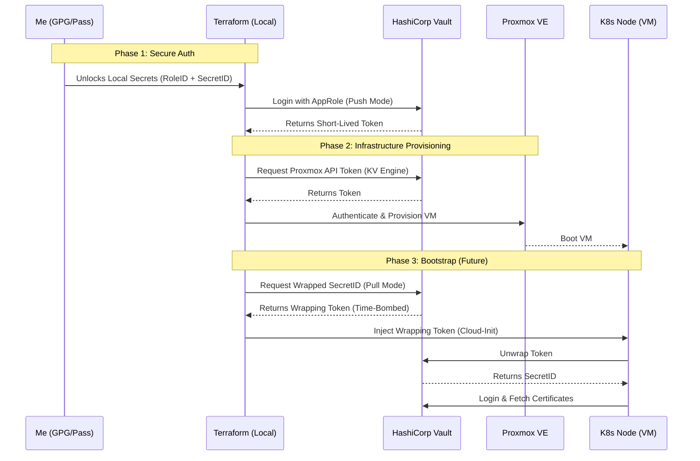

# Kubernetes The Hard Way (IaC Edition)

> **A security-first implementation of the classic "Kubernetes The Hard Way" tutorial, engineered for the modern cloud Platform stack.**

## 📋 Project Overview

This repository contains the Infrastructure as Code (IaC) to bootstrap a Kubernetes cluster from scratch on **Proxmox VE**. 

Unlike the original guide which relies on manual shell commands and static files, this project implements a **secure** architecture. It leverages **Terraform** for state management and **HashiCorp Vault** for dynamic secret injection, ensuring that no sensitive credentials (SSH keys, API tokens, TLS certificates) are ever hardcoded in the codebase.

## 🏗 Architecture & Trust Flow

The system uses a strict "Chain of Trust" to provision infrastructure without leaking secrets.

## 🔐 Key Features (so far)

### Security

I implemented a **Zero Trust** Secret Management workflow:

- **Eliminated implicit trust:** Replaced hardcoded credentials with dynamic, identity-based authentication using **Vault AppRole**.
- **Enforced Least Privilege:** Scoped Terraform's access using granular Vault policies, ensuring it can only read specific infrastructure secrets.
- **Secured the 'Secret Zero':** Protected initial bootstrap credentials using **offline** encryption (GPG/Pass) rather than plain-text environment variables.

### Automation

- **Terraform:** Provisions the underlying infrastructure (Compute, Networking, ...) on Proxmox and configures Vault AppRoles.
- **Ansible:** (Planned) Bootstraps the Kubernetes control plane, installs container runtimes (containerd), and manages OS-level configuration, replacing manual scp and ssh loops.
